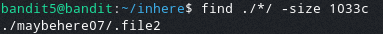

# Bandit Level 5

In this level the password for the next level is stored in a file somewhere in the inhere directory and has the following properties:

* Human readable
* 1033 bytes in size
* Non executable

To find this file we will use the `find` command, with the argument `-size`, to help us find all files that are specifically 1033 bytes in size. To specify that the size is in bytes we append `c`.
> `find ./*/ -size 1033c`

After running this it returns one file.

Opening this file reveals the password: `DXjZPULLxYr17uwoI01bNLQbtFemEgo7`
