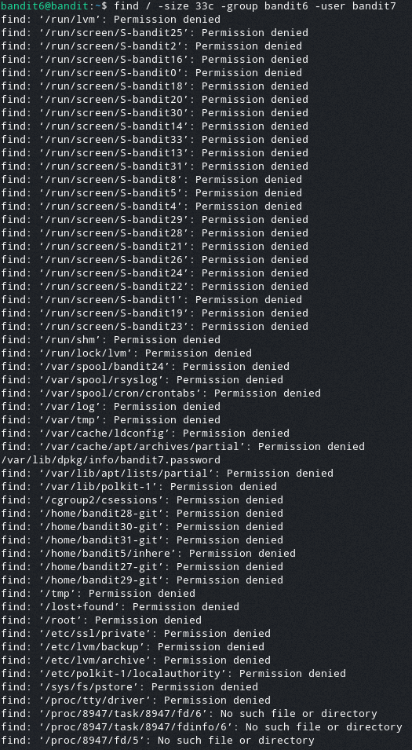

# Bandit Level 6

For this level the challenge is to find the password file that is stored somewhere on the server
The details we know about it are:

* It is owned by user bandit7
* It is owned by group bandit6
* It is 33 bytes in size

To find this file we will use the `find` command, with the arguments `-size`, `-user`, and `-group`. To specify that the size is in bytes we append `c`.
> `find / -size 33c -user bandit7 -group bandit6`

After running this command we get the output:

The only file that matches this is `/var/lib/dpkg/info/bandit7.password`.

Opening this file reveals the password: `HKBPTKQnIay4Fw76bEy8PVxKEDQRKTzs`
