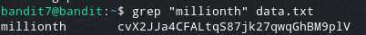

# Bandit Level 7

In this level the password is stored in the file `data.txt` next to the word `millionth`

To do this we use the command `grep`. Grep filters out any lines that don't match a regular expression. In our case the word we want to look for is millionth.
> `grep "millionth" data.txt`

After we run this command we get the output

This reveals the password: `TESKZC0XvTetK0S9xNwm25STk5iWrBvP`
