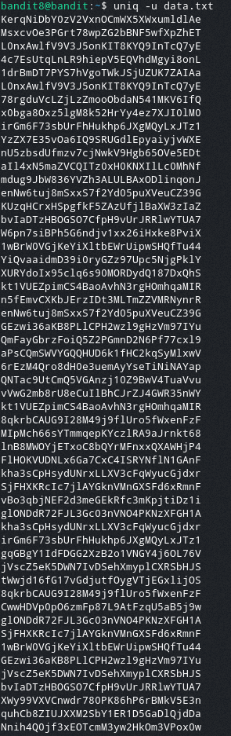

# Bandit Level 8

In this level the password is stored in the file `data.txt` and is the only unique line of text that occurs only once.

For this we use the command `uniq -u`. This command filters out all lines that occur more than once in the file.
> `uniq -u data.txt`

The output isn't as expected:

The reason we're not getting a single output is that `uniq` cannot find duplicate lines if they are not adjacent. To achieve this we can `sort` the file. We can then pipe the output of `sort` into `uniq -u` to find the unique line.
> `sort data.txt | uniq -u`

The output is a single line, revealing the password: `UsvVyFSfZZWbi6wgC7dAFyFuR6jQQUhR`
