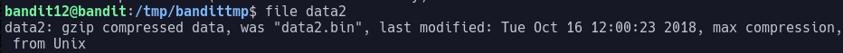
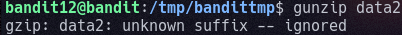
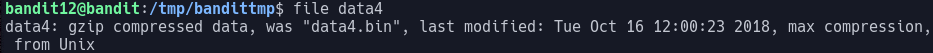

# Bandit Level 12  
In this we are first given a file that is a hexdump of another file.  
  
To allow us to modify the files we can make a directory in the /tmp directory using:  
> mdkir /tmp/<folder_name>  
  
And then we can copy the file data.txt to our directory using:  
> cp data.txt /tmp/<folder_name>  
  
Now we can modify files we must first work out how we can convert a hexdump into a file again  
  
To do this we can use xxd. this command can be used to reverse hexdumps back to the original files by piping in the file to the command with the "-r" argument  
This makes our command:  
> cat data.txt | xxd -r >data2  
  
The ">data2" at the end of the command just redirects the output into a file  
  
When we now look as the file using "file data2" we get the output:  
  
  
This tells us that we now have a gzip compressed file. GNU  
  
Gzip is a popular data compression program originally written by Jean-loup Gailly for the GNU project.  
  
We can now try to decompress this file using the command "gunzip" with the argument "-c" to write to stdout  
  
After running the command:  
> gunzip -c data2 > data3  
  
We get the responce:  
  
  
As gunzip cannot tell that the file is a gzip file as it does not have the correct suffix. We can fix this by using the command:  
> mv data2 data2.gz  
  
This will rename the file data2 to data2.gz allowing us to unzip the file  
  
After running our command we said earlier we now get a new file which apon inspection with the file command gives:  
  
  
bzip2 is a free and open-source file compression program that uses the Burrows–Wheeler algorithm. We can use this to decompress the file using the command "bunzip2" with the argument "-c" to write to stdout  
  
After running the command:  
> bunzip2 -c data3 > data4  
  
We recive another file which on inspection using the file command we get:  
  
  
We can use the previous command from the last gzip file but just change the file names and after decompressing that file we get the next file which is:  
  
  
tar is a computer software utility for collecting many files into one archive file  
We can unpack the tar file by using the "tar" command with the "-xvf" arguments which stand for extract file makingthe final command:  
> tar -xvf data5  
  
This produces a data5.bin file which apon inspection is another tar archive which once decompressed produces data6.bin  
  
This apon inspection using the file command is another bzip2 file so we can use the previous command to extract it  
  
After this we get another file which is a tar archive which we now know how to extract  
  
This produces data8.bin which we can see is a gzip compressed file which we can now decompress  
  
After decompressing this file we find that this time it is an ASCII text file  
This tells us we have fully decompressed the file and inside the file we find  
The password is: 8ZjyCRiBWFYkneahHwxCv3wb2a1ORpYL  
