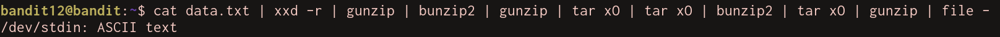

# Bandit Level 12
In this we are first given a file that contains a hexdump.

We need to convert the hexdump back to a binary file. This can be done using `xxd -r`. We can pipe this into `file -` to see what the data is.
> `cat data.txt | xxd -r | file -`

This tells us that the hexdump is gzip compressed data. We can decompress this using the command `gunzip`.
> `cat data.txt | xxd -r | gunzip | file -`

We now have some bzip2 compressed data. This can be decompressed with `bunzip2`.
> `cat data.txt | xxd -r | gunzip | bunzip2 | file -`

The next level down is another gzip file, and inside that there is a `.tar` archive. tar archives can be decompressed on the command line using `tar xO`.
> `cat data.txt | xxd -r | gunzip | bunzip2 | gunzip | tar xO | file -`

Inside that we have another tar archive, then another bzip2 file, then another tar archive. Inside that is gzip data and then finally we have ASCII text.
> `cat data.txt | xxd -r | gunzip | bunzip2 | gunzip | tar xO | tar xO | bunzip2 | gunzip | file -`

Removing the `| file -` reveals the password: `8ZjyCRiBWFYkneahHwxCv3wb2a1ORpYL`
