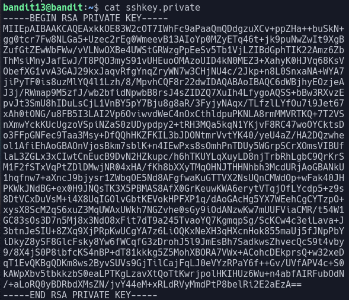

# Bandit Level 13

In this level we need to login to the next level using a private ssh key.

When we look at the file `sshkey.private` in the home directory, we see that it contains the ssh key for the next level.

We attempt to connect to `localhost` (the same PC that we're already on) with the user `bandit14`.
> `ssh bandit14@localhost`

When we run this we are asked for a password, which we do not have. To specify a key to use we use the flag `-i`.
> `ssh -i sshkey.private bandit14@localhost`

This command works, and we are now logged in as bandit14. Opening `/etc/bandit_pass/bandit14` reveals the password: `4wcYUJFw0k0XLShlDzztnTBHiqxU3b3e`
