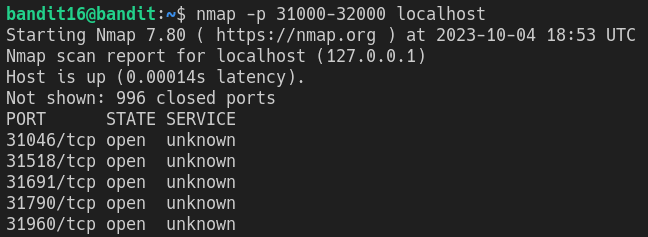
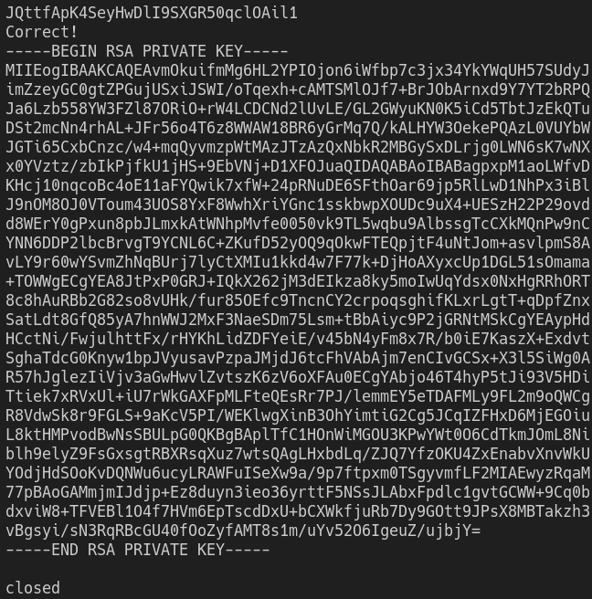
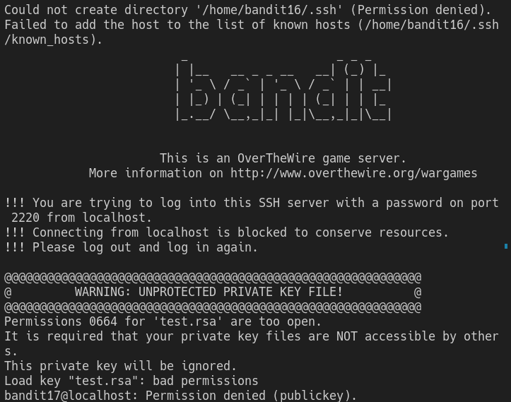

# Bandit Level 16

In this level we need to scan a range of ports to tell on which one there is a server running.

This process is called "port scanning", and it is achieved with `nmap`, with the syntax `nmap -p <start_port>-<end_port> <server>`
> `nmap -p 31000-32000 localhost`

The output of this command will look something like this:

We can now try these ports using `openssl s_client -host localhost -port <port>`. The server on port `31790` is the correct one, and it requests the password to the current level. After we enter this, it gives us a private key.

We need to save this key so it can be used, so we copy it into a text file somewhere in `/tmp/`. Make sure to give this file a unique name.

When we try to use this key to login to the next level, we get an error.

This is because it has the wrong file permissions. For security reasons ssh keys need to have the permissions of u=rw-, g=---, o=--- (read-write for the owner of the file, nothing for anyone else). To change the permissions on a file we use the `chmod` command.
> `chmod u=rw,g=,o= <filename>`

Now that the file has the correct permissions, we can connect to the next level.
> `ssh -i <filename> bandit17@localhost`

Once we've connected, we can open with `cat /etc/bandit_pass/bandit17`, revealing the password: `VwOSWtCA7lRKkTfbr2IDh6awj9RNZM5e`
