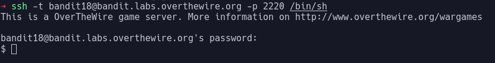

# Bandit Level 18

In this level when we connect we are immidiatly disconnected with the message `Byebye !`.

This is because this level has a modified `.bashrc` file (the script that is run on every login) to automatically exit as soon as it's open. We need to find a way of ignoring the bashrc.

One way to do this is to specify a different shell to use instead of `/bin/bash`. This can be done by appending the command to run at the end of the ssh command. We also need to specify that the command we are running is interactive with `-t`:
 > `ssh -t bandit18@bandit.labs.overthewire.org -p 2220 /bin/sh`

This command gives us a shell!

This shell looks slightly different to bash, and lacks a few features, but for our purposes it will work fine.

Opening the `readme` file reveals the password: `awhqfNnAbc1naukrpqDYcF95h7HoMTrC`
