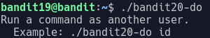

# Bandit Level 19

In this level we are told to use the suid binary to get the password to the next level

suid binarys run at an elevated level and if we run "ls -all" we will see that:

This program is running as the user bandit20

When we execute the binary we are greeted with this:

As this program allows us to run commands as the user bandit20 there is nothing stopping us looking at  /etc/bandit_pass/bandit20 to find the password which when opened with cat gives us the password: GbKksEFF4yrVs6il55v6gwY5aVje5f0j
