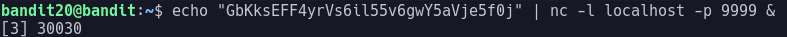

# Bandit Level 20

In this level we have another suid binary however this one given a port number will connect to the port specified and if given the current levels password will give us the password for the next level

Obviously we need to host a connection for our suid binary to connect to

The nc command can also be used to host listning servers as well as connecting ones using the "-l" argument

The command will follow the format:
> nc -l \\<address> -p \\<port>

We also need to make our server send the password to any connection
For this we can use echo to send output to our server

This now makes our command:
> echo "GbKksEFF4yrVs6il55v6gwY5aVje5f0j" | nc -l localhost -p 9999

The only problem now is that when running this command we can no longer run the suid binary as that program is now taking over

We need to run this program in the background and we do that by putting a & at the end of the command

Apon running the command we get this:

This tells us that our program is running on pid 30030

And we can now connect to it with the ./suconnect binary on the correct port

Once we run the command we are given the password: gE269g2h3mw3pwgrj0Ha9Uoqen1c9DGr
