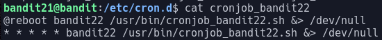
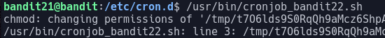

# Bandit Level 21

For this level we are told to look at a program that is running at regular intervals and that looking in `/etc/cron.d` might help.

When we look at the contents of `/etc/cron.d` we can see 4 crondjobs. Three of these are of interest.

Looking at the contents of `cronjob_bandit22` shows us this:

This cronjob runs a program located at `/usr/bin/cronjob_bandit22.sh`. Running this ourselves gives us the following output.

We can see the program is trying to access a file named `/tmp/t7O6lds9S0RqQh9aMcz6ShpAoZKF7fgv`. Looking at the contents of this file reveals the password: `WdDozAdTM2z9DiFEQ2mGlwngMfj4EZff`
