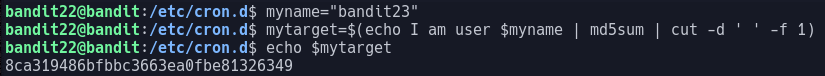

# Bandit Level 22

This time we have another program that runs at regular intervals so we check inside the `/etc/cron.d` direcroy again this time using the file `cronjob_bandit23`

When we run the script we get the debug message:


This time we can look at the shell script to do a bit of digging.

The shell script is as follows:
```sh
#!/bin/bash

myname=$(whoami)
mytarget=$(echo I am user $myname | md5sum | cut -d ' ' -f 1)

echo "Copying passwordfile /etc/bandit_pass/$myname to /tmp/$mytarget"

cat /etc/bandit_pass/$myname > /tmp/$mytarget
```

In this we see that the program works out what user you are and then creates a target based off of that
Then copies the password to the new target file

As we know we want to look at bandit23's password we can rn the function it uses o create a target file but set myname to be bandit23

This would look like this:


We can now look inside the file at `/tmp/8ca319486bfbbc3663ea0fbe81326349` which gives us the password: `jc1udXuA1tiHqjIsL8yaapX5XIAI6i0n`
