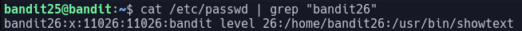
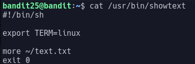
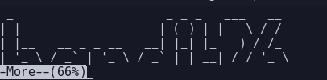

# Bandit Level 25

In this level we are told that we have another shell other than `/bin/bash` however on login to this shell we are given the welcome screen and then immidiatly logged out

If we look in `/etc/passwd` we can find what shell the user is running by

The passwd file shows:

Now we can look at what the shell they are running is:

This shows us it is using more to show text.txt and then exiting the shell

The way to stop us being immidiatly booted out of this shell is by leveraging the more command

more uses vi to show the message and if we make the window small enough we will be able to open vim as more tries to allow us to scroll

After re-logging in with a small window we are greeted with this:

We can now press v to allow us to start typing commands and use the command
> `:e /etc/bandit_pass/bandit26`

As this command will open another file in our editor

After running this command we get the password: `5czgV9L3Xx8JPOyRbXh6lQbmIOWvPT6Z`

