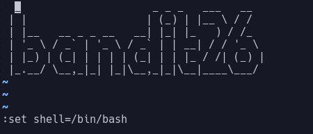

# Bandit Level 26  
Now using the exploit we found in the previous level we need to take this further and find a way to get a shell using the more exploit  
  
We can use editor commands to try to get a normal when but when we use the editor command:  
> :shell  
  
we just get shoved back into our more problem  
  
Instead we can just overwrite shell like this:  
  
  
This overwrites the shell command to nolonger point to /usr/bin/showtext but to bash instead  
  
Now when we run :shell  
  
  
If we now look in our home directory we have another suid binary "bandit27-do" so we can run the command:  
> ./bandit27-do cat /etc/bandit_pass/bandit27  
  
Which gives us the password: 3ba3118a22e93127a4ed485be72ef5ea  
