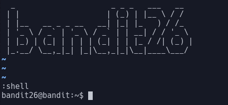

# Bandit Level 26

In this level we need to get a shell, as before we only had a text editor.

In vim there is a command `:shell`, which opens a shell. The problem is that when we run this it looks in `/etc/passwd` and just runs `more` again. We can, however, set environment variables in vim.
> `:set shell=/bin/bash`

This means that when we run `:shell` it will run bash, giving us what we want.

Looking in the home directory we have a suid binary, similar to [level 19](Bandit_Level_19.md).
> `./bandit27-do cat /etc/bandit_pass/bandit27`

This reveals the password: `3ba3118a22e93127a4ed485be72ef5ea`
