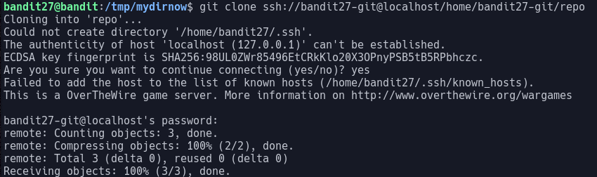

# Bandit Level 27

In this level we are told there is a git repo at :
> `ssh://bandit27-git@localhost/home/bandit27-git/repo`

and we need to clone it

Git is a distributed version-control system for tracking changes in source code during software development

In this case we need to use the command `git clone` to clone the repo hosted at the given address to somewhere local

The output of the command is as follows:

And after it has finished executing we see there is now a directory called repo which once we cd into we have one file called README which contains the password: `0ef186ac70e04ea33b4c1853d2526fa2`
