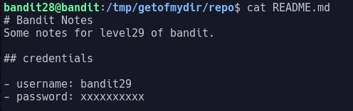
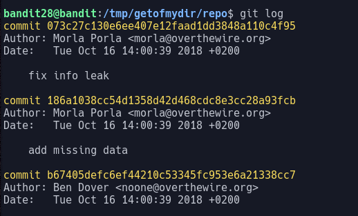

# Bandit Level 28

In this level we are asked to clone a git repo to find the password.

First, we clone the repo with `git clone`. Looking in the `README` file we see that the password has been redacted:

This means that we need to find an older version of this file with the password still there. We can use `git log` to see the log of commits.

As we can see there is a commit with the message "fix info leak". If we look at the file before this commit was made, it may contain the password. We can look at the state of a repo at a certain commit using the command `git checkout`.
> `git checkout 186a1038cc54d1358d42d468cdc8e3cc28a93fcb`

Now, if we look at the `README` file we see the password: `bbc96594b4e001778eee9975372716b2`
