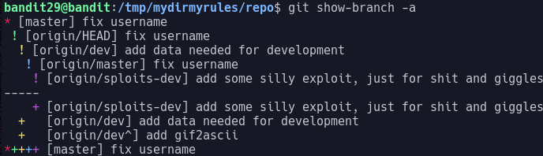
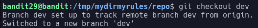
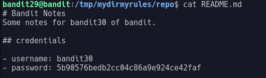

# Bandit Level 29

This level is another git repo one so after cloning the repo same as the last few we look inside the README and find:

This tells me a quick hint, the fact it says in production gives me a hint there are other branches

The command git show-branch is used to show branches and with the "-a" argument can show all possible branches

Once I run this command I get the output:

Here I can see there are 3 branches:
- master
- dev
- sploits-dev

I can now change my branch with the git checkout command from before but this time place the name of the branch I wish to be on
After running the command:
> git checkout dev

I get the output:

I can now open the README and am greeted with:

This tells me the password is: 5b90576bedb2cc04c86a9e924ce42faf
