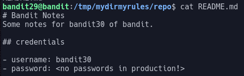

# Bandit Level 29

In this level we are asked to clone a git repo to find the password.

Looking in the `README` file we see a message saying that passwords aren't allowed in `production`.

This message implies that there is somewhere where passwords are allowed. We can use the command `git branch` to show us the list of all branches in the repo.
The command git show-branch is used to show branches and with the `-a` argument can show all possible branches

Running this command shows us that there are two other branches:

- dev
- sploits-dev

We can change which branch we're on with the command `git checkout`.
> `git checkout dev`

Now, if we look at the `README` file we see the password is present: `5b90576bedb2cc04c86a9e924ce42faf`
