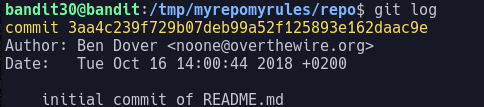

# Bandit Level 30

In this level we are asked to clone a git repo to find the password.

Looking in the `README` file we see that it is "just an empty file"

Looking at `git log` we see that there are no previous versions of this file to look at.

We can also run `git branch` to see that there are also no other branches.

There is one more object in git that we have yet to encounter in bandit, that being the git tag. A git tag is basically a name assigned to another object. These can be listed with `git tag -l`. Running this command shows us that there is a tag called `secret`. We can see what the tag points at by running `git show`.
> `git show secret`

This reveals the password: `47e603bb428404d265f59c42920d81e5`
