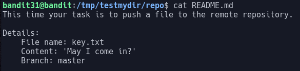
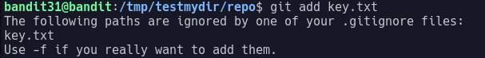
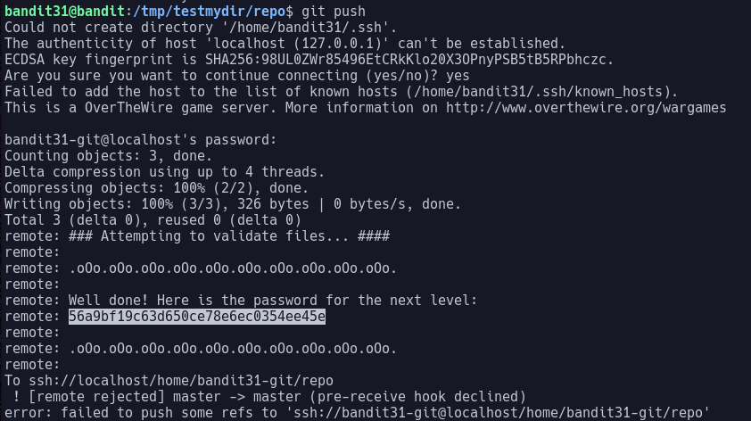

# Bandit Level 31

In this level we are asked to clone a git repo to find the password.

Looking at the `README` file we are given the following hint:

First, we create the file requested, `key.txt`, with the contents `May I come in?`. We now need to commit this file and push it. To commit a file, first we need to tell git that it exists.
> `git add key.txt`

This command returns an error, stating that the file `key.txt` is set to be ignored:

We can override the ignore files with the flag `-f`. We now need to commit this file. This is done with the command `git commit`.
> `git commit -m <update_message>`

We can supply any commit message as the task only checks the file. We now need to push the commit to the remote repo. This is done with the command `git push`. This command generates a reply from the server:

This response contains the password: `56a9bf19c63d650ce78e6ec0354ee45e`
