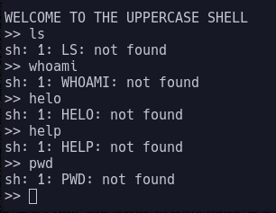
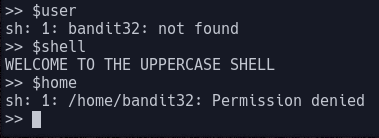

# Bandit Level 32

In this level we do not get much of a hint; we are merely told that it is another escape challenge.

When we connect to the level, we get the message `WELCOME TO THE UPPERCASE SHELL`

As we start to run commands, we can see that the shell is not interpreting them properly. It is converting them to uppercase before parsing them.

Unlike Windows, Linux systems are case-sensitive. Due to the fact that most linux commands are lowercase, we can't run any commands. One of the few things that are uppercase are environment variables. These are used to communicate system information (such as the shell used or the location of binaries) to programs. Some common ones include:

- `$SHELL`
- `$PATH`
- `$USER`

These expand to their contents, so if they point to a binary we are able to use that binary.

There is one environment variable that is present on some (but not all) Linux systems that points to the system backup shell. Running `$0` as a command gives us a `/bin/sh` session. Using this shell we can open the password file `/etc/bandit_pass/bandit33`, revealing the password: `odHo63fHiFqcWWJG9rLiLDtPm45KzUKy`
