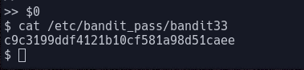

# Bandit Level 32  
  
In this level we do not get much of a hint as to what to do  
  
Apon sshing into the shell we recive the message "WELCOME TO THE UPPERCASE SHELL"  
  
As we start to type commands we realise that all of the command we typing are being converted to upper case and not being recognised:  
  
  
All linux commands need lowercase letters the only exception being some environment vairables  
  
Environment variables are used to have as shortcuts for other things to make them more easy to use  
Some common ones include:  
- \\$SHELL  
- \\$HOME  
- \\$USER  
  
as you can see we can use all of these however nonoe of these are much use without other linux commands:  
  
  
One other option is to look for other commands or environment variables that dont contain letters  
  
One common one that is pre-installed in some linux systems is \\$0 which is short for the system default shell  
  
When we run this command we are luckily greeted with something that is not an error but instead an as shell we can now use to cat open the /etc/bandit_pass/bandit32 password file:  
  
  
Giving us the password: c9c3199ddf4121b10cf581a98d51caee  
   
