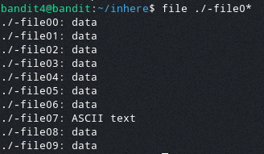

# Bandit Level 4

In this challenge the password is stored in the only human readable file in the inhere directory.

Once we enter the directory we are greeted with 10 files names --file0[number]

To find this we can use the file command which will return the type the file is
We can use the command
> file ./-file0[number]

To view the file type
To make this faster we can use the wildcard character * which will allow that character to be anything
This allows us to check all of our files in one command as they follow a format making our final command
> file ./-file0*

This command returns this:

As we can see there is one file that is made up of ASCII text
When it is opened it shows us the password: koReBOKuIDDepwhWk7jZC0RTdopnAYKh
