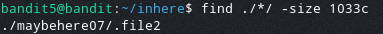

# Bandit Level 5  
  
In this level the password for the next level is stored in a file somewhere in the inhere directory and has the following proporties  
- Human readable  
- 1033 bytes in size  
- Non ecexutable  
  
To find this file we will use the find command and use some arguments to help specify down the search  
  
We are going to use the -size argument to help us find all files that are specifically 1033 bytes in size  
As it is bytes we must put a letter c after the 1033  
This makes the command:  
> find ./*/ -size 1033c  
  
After running this it returns one file that is openable  
  
  
After opening this file we get the password: DXjZPULLxYr17uwoI01bNLQbtFemEgo7  
  
  
