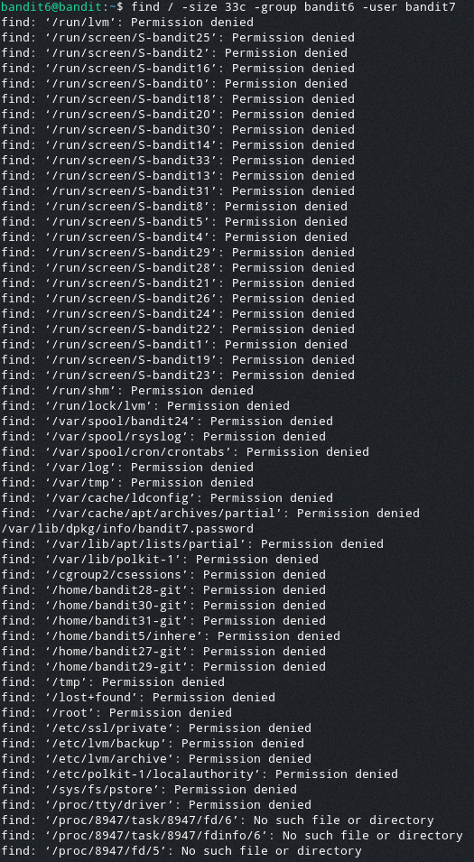

# Bandit Level 6  
  
For this level the challnge is to find the password file that is stored somewhere on the server  
The details we know about it are:  
- It is owened by user bandit7  
- It is owned by group bandit6  
- It is 33 bytes in size  
  
We will use the find command again for this but will add more arguments  
We will be using the "-size" argument again and we will also use the "-user" and "-group" arguments  
The command we can construct is:  
> find -size 33c -user bandit7 -group bandit6  
  
After running this command we get the output:  
  
  
There is one file in this list that catches my eye being:  
"/var/lib/dpkg/info/bandit7.password"  
  
After opening this file we get the password: HKBPTKQnIay4Fw76bEy8PVxKEDQRKTzs  
