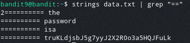

# Bandit Level 9  
  
In this level the password is stored in the file data.txt in one of the only human readble strings beginning with several = characters  
  
To do this we will use the strings command.  
This command returns all human readble strings in a file.  
  
To narrow down the output even more we can pipe the output of this command into the grep command searching for "=="  
The command will look like this:  
> strings data.txt | grep "=="  
  
Once the command runs we get the output:  
  
  
As we can see the password is: truKLdjsbJ5g7yyJ2X2R0o3a5HQJFuLk  
