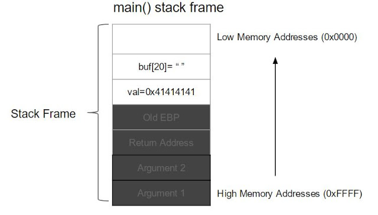
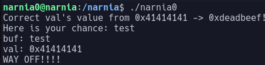
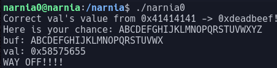
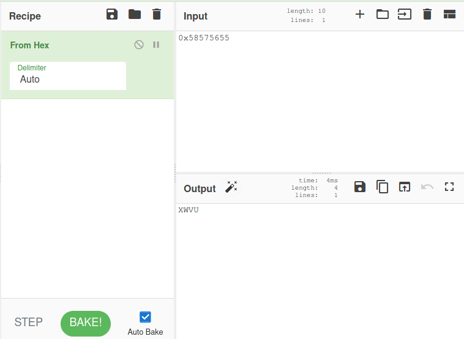
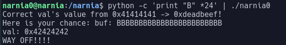
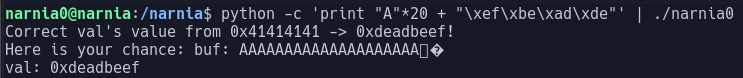
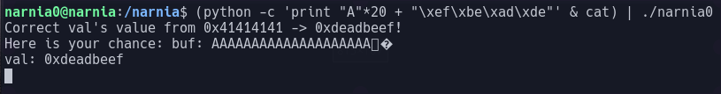
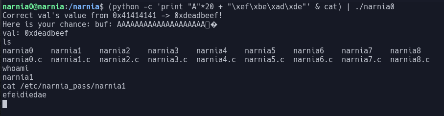

# Narnia Level 0  

In this level we have a binary narnia0 that runs suid as narnia1 and the source code  

THe source code is as follows:  

```c  
#include <stdio.h>  
#include <stdlib.h>  
  
int main(){  
    long val=0x41414141;  
    char buf[20];  
  
    printf("Correct val's value from 0x41414141 -> 0xdeadbeef!\\n");  
    printf("Here is your chance: ");  
    scanf("%24s",&buf);  
  
    printf("buf: %s\\n",buf);  
    printf("val: 0x%08x\\n",val);  
  
    if(val==0xdeadbeef){  
        setreuid(geteuid(),geteuid());  
        system("/bin/sh");  
    }  
    else {  
        printf("WAY OFF!!!!\\n");  
        exit(1);  
    }  
  
    return 0;  
}  
```

In this challenge we are told to change the value of the variable val to 0xdeadbeef  

Here we can exploit scanf to input more data than necessary and commit a buffer overflow attack  

The variable val is placed on the stack and we have our buffer buf is placed above it as Stacks grow from high memory addresses to low memory addresses.

  

If we place more information onto the stack than the stack can hold we can overwrite the contents of the variable val  

If we run the program we get the output  
  

Here we see that we have not overwritten val as there is still free space in the stack  

If we instead fill the input box with letters lets see what happens:  
  

Here we see that val is now equal to `0x58575655`  

if we convert this to ASCII we can see what it now contains  
  

As you can see val now contains XWVU which is the 24th to 21st letter of our input string  
This means that we over flow val after 20 characters but why is it backwards?  

This is due to endianness which refers to the order of bytes within a binary representation of a number  

The numbers in this are stored in reverse order for each 4byte section  
So our string is stored as:  
> String: ABCDEFGHIJKLMNOPQRSTUVWXYZ  
> Endian Representation: DCBAHGFELKJIPONMTSRQXWVUZY  

Now we need to change the value to `0xdeadbeef` so using little endian this becomes `0xef 0xbe 0xad 0xde`  

One small problem is when we type this into the input provided by the program it will be interpreted as ascii so we need to use python to print out our overflow string  

We will use a command like this to enter data into the program:  

  

This program prints 24 B's and then pipes the output of that command into our program  

Now we know the buffer length and correct string we have to enter all we need to do is create the correct python command  

In python when printing hex numbers you place \\x before them this makes our final command:
`python -c 'print "A"*20 + "\\xef\\xbe\\xad\\xde"' | ./narnia0`  

After running this command the output is as follows:  
  

This time we do not get the "WAY OFF!!!!" text and we can see that we have changed value to the correct number however we didnt get a shell  

We need to persists the command shell executed by `system("/bin/sh")`  
To do this we can pass a command into the program in the format `(command 1 & command 2) | ./prog`  

This will pass the output of the first command into the scanf() and by passing the **cat** command into the program it keeps the elevated shell open  

The final command becomes:  
`(python -c 'print "A" * 20 + "\\xef\\xbe\\xad\\xde"' & cat) | ./narnia0'`  

After executing this command we are greeted with this:  
  

It is just a text prompt so there is no username however this allows us to enter commands like so:
  

After some exploring we find the password is  `efeidiedae`  
