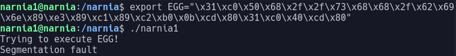
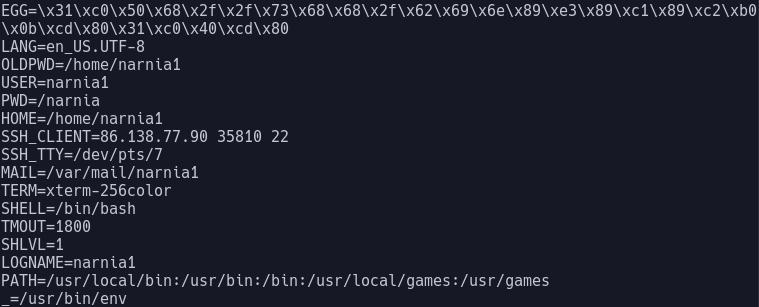
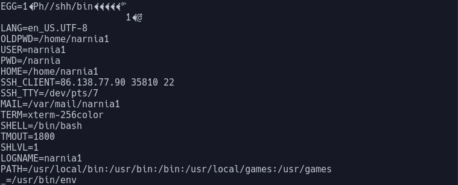
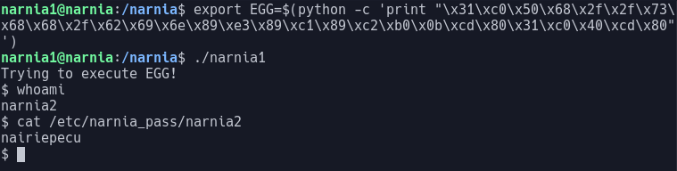

# Narnia Level 1

In this level we have a binary narnia1 that runs suid as narnia2 and the source code

The source code is as follows:

```c
#include <stdio.h>

int main(){
    int (*ret)();

    if(getenv("EGG")==NULL){
        printf("Give me something to execute at the env-variable EGG\n");
        exit(1);
    }

    printf("Trying to execute EGG!\n");
    ret = getenv("EGG");
    ret();

    return 0;
}
```

The code uses the function `getenv` which returns the value of what is stored at the environment variable given as an argument. Then the program places the value returned from `getenv` into a pointer to a function named `ret` that returns an integer and then that function is run.

The aim is to place something executable into an environment variable named `EGG` that will be run as a function.

To create an environment variable we use the command `export=“value in environment variable”`.

If we attempt to place some raw commands into our environment variable we are returned this error:


This shows us that the program is unable to execute this as a function. This is because what is returned from the `getenv` function is just the string we placed into our environment variable

We need to make it so that what is returned from `getenv` is executable as a function. To do this we use shellcode. Shellcode is a small piece of code used as the payload in the exploitation of a software vulnerability. Shellcode is directly executable and is written in hexadecimal.

Shellcode is able to be found easily online and it is also possible to write your own shellcode however you should be very careful where you source your shellcode if you dont write it yourself. I reccomend using websites such as *shell-storm.org* to source your shellcode and that is where the shellcode we will be using comes from.

The shellcode we need is to run `/bin/sh` allowing us to gain a shell as narnia2. This shellcode is as follows:
```\x31\xc0\x50\x68\x2f\x2f\x73\x68\x68\x2f\x62\x69\x6e\x89\xe3\x89\xc1\x89\xc2\xb0\x0b\xcd\x80\x31\xc0\x40\xcd\x80```

We now need to place this into the environment variable EGG. To do this we can use the export command again however after completing this we are returned this error:



This is because even though we have placed the shellcode into the environment variable it is still classed as a string of ASCII characters not the actual shellcode itself.  We can see this by using the `env` command which shows us the variables in the environment. Here we see the value of `EGG` alongside the other environment variables:



To change this from just being a string we need to find something that can print our shellcode into its executable format. To do this we can use python.

Python can be used to print our shellcode into the environment variable which makes it executable.

The new command becomes:
 `export EGG=$(python -c ‘print “\x31\xc0\x50\x68\x2f\x2f\x73\x68\x68\x2f\x62\x69\x6e\x89\xe3\x89\xc1\x89\xc2\xb0\x0b\xcd\x80\x31\xc0\x40\xcd\x80"')`

After this command is run we can see that the value of `EGG` in the environment has changed to:



Now when we execute the program narnia1 we get the output:



Which gives us a shell where we are the user narnia2 and we can see that the password is: `nairiepecu`